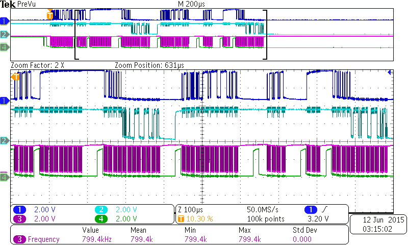

# Battery Control Module 

# Introduction

Over my short 4 month work term at the MARC (McMaster University Automotive Resource Centre), I was tasked to interface a battery control system among different ICs (integrated circuits).
More specifically, I was tasked to interface the Linear DC2100A  with the Texas Instruments TMS320F28377D development board via SPI (serial peripheral interface).
I had no previous experience in this field of embedded programming before and thought it would be a great way for me to learn and expose myself to the embedded world.
As a disclaimer, I take no claim that this project is optimal in how I implemented it and that I treated it as a learning experience while meeting deadlines throughout the term.
I also take no claim in that if you were to copy this code and implement it into your project, it could work just as easily for you since there are slight nuances in every IC dev board. 

# Purpose

Generally TI boards come with Simulink interfaces so that low level coding would be unnecessary for development. However, due to how new the TI320F28377D development board was at the time, 
no Simulink interface was implemented as of yet. As a result, I was tasked to create a 'high-level' interface for the board so that my team could implement high level battery balancing strategies to the 18650
battery modules. In our specific case, we were interested in balancing 18650 batteries tied to the DC2100A board.

# Firmware Design

The purpose of my firmware design was to set up the required registries and code functionality for my colleague to implement high level battery balancing algorithms.
The firmware consisted of SPI bus communications from the TMS320F28377D to the LTC3300 and LTC6804 ICs. In order for the TI chip to communicate, specific SPI signals 
were generated depending on the type of balancing algorithm wanted. In our case, we were most interested in using the LTC3300 chips since they would allow for active battery balancing throughout
the batteries. The LTC3300 chips would require a special set of SPI instructions and PEC (packet error code) redundancy checks in order for the chip to correctly operate. 

My initial approach to the SPI bus communication between ICs was to consistently poll data across the bus and IC to ensure IC compatibility. Eventually however, 
I was able to utilize timer interrupts which would allow for more efficient hardware utilization and effectively implement battery balancing strategies and battery status checks in parallel.
As a result, I ended up developing a high level modularity code structure for the TI 320F28377D to DC2100A board with hardware interrupt conditions.

# Troubleshooting 

Throughout my time at MARC, I used a variety of tools to debug and analyze my progress on the firmware side of things. I was privileged to use the oscilloscope and multimeters available to me.
The Tektronix MDO3000 Mixed Domain Oscilloscope and Fluke multimeter were my tools available. These tools allowed me to test and debug the SPI signals and ensure I was properly transmitting channels through
the various ICs used. It greatly helped me discover early on as to why I was unable to retrieve signals from the LTC3300 and LTC6804 ICs as there was improper PEC data parsing of the signals.
This was later resolved by implementing the recommended PEC calculations provided by the datasheets and allowed for SPI communications to be verified on both ends of the system. In addition, the Code Composer Studio IDE helped visualize how memory allocation was used and allowed me to allocate according to the amount of memory I had available (1MB Flash). 

 

# Future work & Discussion

Modularity, modularity, modularity. If I could look back and improve how I went about this project, I would look to modularize and cut down the amount of unnecessary code I've written.
Only later had I realized that I was coding in the wrong manner and not using embedded C's preprocessor functionality which would have saved some code overhead.
Also, I was able to complete the final documentation file for my team lead, but was very unhappy
the way it was handled. If I had a second chance, I would rework how the documentation file was to be formatted and documented. However, given the circumstances of my work deadline, I completed the task within a reasonable timeframe and my supervisor/team lead was more than happy with what I had accomplished.

Overall, I was pretty satisfied how things turned out. 
I was able to deliver the final project code to my electrical team lead who was able to easily implement his battery algorithm strategies with minimal effort using my functional C code.
In addition to all that, I was able to learn, develop, and implement an embedded solution on my own, from initial code configuration to hardware oscilloscope probe debugging & testing.
It gave me great insight as to how problems were to be tackled from a software perspective and hardware perspective, meeting both code compilation standards and hardware limitations of my constrained system.
